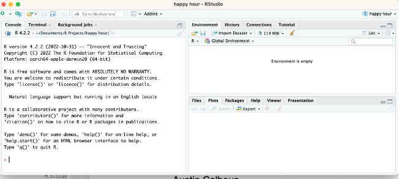
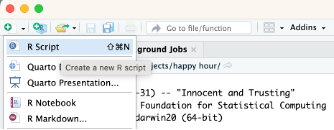
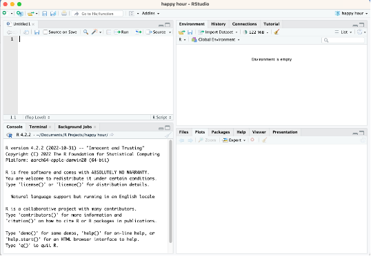
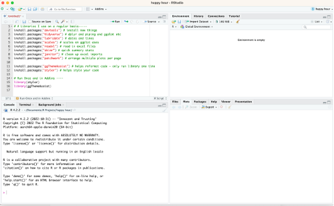

# INTRO_R\_2023

## This is an introductory R course for ISU

## How to install R and R studio

1.  Install R first -- download the version for your computer from - <https://cran.r-project.org/> - This is the guts of the system and I refer to it as Base R

2.  Then install R studio from - <https://posit.co/download/rstudio-desktop/> - Note that they have a link to R at the top as well

3.  If you have a PC you will need to install RTools from - <https://cran.r-project.org/bin/windows/Rtools/rtools42/rtools.html>

4.  Make sure you can start RStudio and that it opens on your computer - You should see something like this 

5.  If you are feeling really up for it you can click the green plus sign in the upper left and create a new script - - - - or you can click FILE -- OPEN and open the attached "install packages.R" file - - - -

6.  

7.  

8.  Copy the following code from below and paste it into the upper left window or you can click FILE -- OPEN and open the attached "install packages.R" file

``` R
# # Libraries I use on a regular basis-----
install.packages("devtools") # install new things
install.packages("tidyverse") # dplyr and piping and ggplot etc
install.packages("lubridate") # dates and times
install.packages("scales") # scales on ggplot ases
install.packages("readxl") # read in excel files
install.packages("skimr") # quick summary stats
install.packages("janitor") # clean up excel imports
install.packages("patchwork") # arrange multiple plots per page

install.packages("ggThemeAssist") # helps reformat code - only run library one time
install.packages("styler") # helps style your code

# Run Once and in Addins ----
library(styler)
library(ggThemeAssist)
```

# Run Once and appears in Addins ----

library(styler) library(ggThemeAssist) \`

7.  It should look like this 

8.  You can move the cursor to line 1 (a comment) and click the green run button in the upper right of the window or on a PC hold down the CTRL + RETURN Button or on a mac the COMMAND + RETURN button. This will install a lot of the packages we will run this term.
